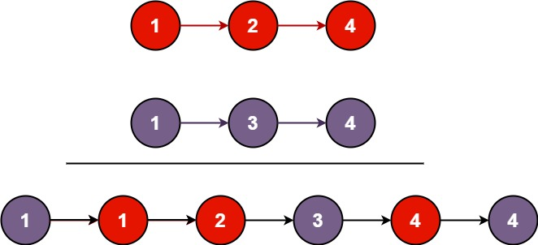

## [21. 合并两个有序链表](https://leetcode.cn/problems/merge-two-sorted-lists/)

将两个升序链表合并为一个新的 **升序** 链表并返回。新链表是通过拼接给定的两个链表的所有节点组成的。

**示例 1：**



```
输入：l1 = [1,2,4], l2 = [1,3,4]
输出：[1,1,2,3,4,4]
```

**示例 2：**

```
输入：l1 = [], l2 = []
输出：[]
```

**示例 3：**

```
输入：l1 = [], l2 = [0]
输出：[0]
```

**提示：**

- 两个链表的节点数目范围是 `[0, 50]`
- `-100 <= Node.val <= 100`
- `l1` 和 `l2` 均按 **非递减顺序** 排列

## 双指针+虚拟节点，类似合并两个有序数组

新建链表怎么新建呢？先确定头节点，再不断确定下一个节点就可以了。

怎么确定头节点呢？根据题目要求，头节点就是两个链表的头节点中的较小的那个。因此我们可以这样写：

```java
class Solution {
    public ListNode mergeTwoLists(ListNode l1, ListNode l2) {
        // 根据两个链表的头节点确定新链表的头节点
        if (l1 != null && l2 != null) {
            if (l1.val > l2.val) {
                ListNode p = l2;
            } else {
                ListNode p = l1;
            }
        } else {
            // l1为空就返回l2，l2为空就返回l1
        }
        
        l1 = l1.next;
        l2 = l2.next;
        while (l1 != null && l2 != null) {
            if (l1.val > l2.val) {
                p.next = l2;
                l2 = l2.next;
            } else {
                p.next = l1;
                l1 = l1.next;
            }
            p = p.next;
        }
        
        if (l1 == null) {
            p.next = l2;
        } else {
            p.next = l1;
        }
        
        return ???
    }
}
```

返回的时候就遇到问题了，我们不能返回 p，因为这时 p 已不是新链表的头节点。**也就是说，我们丢失了新链表的头节点。因此我们需要一个虚拟节点来存储新链表的头节点。**

**虚拟节点还有一个好处，那就是我们可以把旧链表的头节点和后面的节点用同一个逻辑处理**。不用虚拟节点的话，我们需要在处理头节点时定义新链表的头节点；用了虚拟节点，我们事先就把新链表的头节点定义好了：ListNode p = dummy，这样处理旧链表的头节点时逻辑就和处理后面的节点的逻辑一样了：p.next = l2; l2 = l2.next;

```java
/**
 * Definition for singly-linked list.
 * public class ListNode {
 *     int val;
 *     ListNode next;
 *     ListNode() {}
 *     ListNode(int val) { this.val = val; }
 *     ListNode(int val, ListNode next) { this.val = val; this.next = next; }
 * }
 */
class Solution {
    public ListNode mergeTwoLists(ListNode l1, ListNode l2) {
        // 这里一定要让 p 和 dummy 分开，我们操作 p，就相当于给 dummy 后面加元素，最后我们要返回 dummy.next 而不是 p.next，因为 p 在不断地前进。
        ListNode dummy = new ListNode(-1);
        ListNode p = dummy;
        
        while (l1 != null && l2 != null) {
            if (l1.val > l2.val) {// 应该是l1.val而不是l1.value
                p.next = l2; // 应该是 p.next = l2 而不是 p = l2; 后面的也是，改完这里还要注意在定义 p 的时候就初始化 p，不然会报空指针异常
                l2 = l2.next;
            } else {
                p.next = l1;
                l1 = l1.next;
            }
            p = p.next; // 不要忘了让 p 前进
        }
        
        // 收尾
        if (l1 == null) {
            p.next = l2;
        } else {
            p.next = l1;
        }
        
        return dummy.next; // 这里一定不要弄错，要返回 dummy.next 而不是 p.next
    }
}

```

- 时间复杂度: $O(n+m)$ ，其中 $n$ 和 $m$ 分别为两个链表的长度。因为每次循环迭代中，l1和 l2 只有一个元素会被放进合并链表中，因此 while 循环的次数不会超过两个链表的长度之和。所有其他操作的时间复杂度都是常数级别的，因此总的时间复杂度为 $O(n+m)$ 。
- 空间复杂度: $O(1)$ 。我们只需要常数的空间存放若干变量。

## 递归+原地修改

**假设我们要合并 1->3->5 和 2->4->6。第一次比较，我们发现 1<2，所以新链表的头节点是 1，接下来我们只需要把 3->5 和 2->4->6合并，再把合并后的链表接到 1 后面即可。**

```java
class Solution {
    // 合并两个有序链表，返回合并后的链表头节点。递归一定要弄明白返回值！
    public ListNode mergeTwoLists(ListNode l1, ListNode l2) {
        if (l1 == null) {
            return l2;
        } else if (l2 == null) {
            return l1;
        }
        
        // 原地修改两个链表
        if (l1.val < l2.val) {
            l1.next = mergeTwoLists(l1.next, l2);
            return l1;
        } else {
            l2.next = mergeTwoLists(l1, l2.next);
            return l2;
        }
    }
}
```

- 时间复杂度: $O(n+m)$ ，其中 $n$ 和 $m$ 分别为两个链表的长度。因为每次调用递归都会去掉 l1 或者 l2 的头节点 (直到至少有一个链表为空)，函数 mergeTwoList 至多只会递归调用每个节点一次。因此，时间复杂度取决于合并后的链表长度，即 $O(n+m)$ 。
- 空间复杂度: $O(n+m)$ ，其中 $n$ 和 $m$ 分别为两个链表的长度。递归调用 mergeTwoLists 函数时需要消耗栈空间，栈空间的大小取决于递归调用的深度。结束递归调用时 mergeTwoLists 函数最多调用 $n+m$ 次，因此空间复杂度为 $O(n+m)$ 。

另法：

注意下面的代码中的

```java
        ListNode res = l1.val > l2.val ? l2 : l1;
        res.next = mergeTwoLists(res.next, l1.val > l2.val ? l1 : l2);
```

可以被修改为

```java
        ListNode res = l1.val < l2.val ? l1 : l2;
        res.next = mergeTwoLists(res.next, l1.val < l2.val ? l2 : l1);
```

但一定要同时修改，不能是

```java
        ListNode res = l1.val > l2.val ? l2 : l1;
        res.next = mergeTwoLists(res.next, l1.val < l2.val ? l2 : l1);
```

不然会出现循环引用的问题，问题的原因是可能存在两个节点的值相等的情况。例如，输入是[1,2,4]和[1,3,4]，那么一开始l1.val = l2.val，那么res = l1 = 1，
接下来我们希望合并[2,4]和[1,3,4]，但是接下来的代码其实合并的是l1.next和l1，因为l1=l2，也不满足l1.val < l2.val。

```java
    public ListNode mergeTwoLists(ListNode l1, ListNode l2) {
        if (l1 == null) {
            return l2;
        } else if (l2 == null) { // 这里一定不能只写 else，否则下面的代码都没用了。
            return l1;
        }
        ListNode res = l1.val > l2.val ? l2 : l1;
        res.next = mergeTwoLists(res.next, l1.val > l2.val ? l1 : l2);
        return res;
    }
```