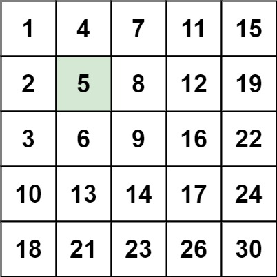

## [240. 搜索二维矩阵 II](https://leetcode.cn/problems/search-a-2d-matrix-ii/)

编写一个高效的算法来搜索 `m x n` 矩阵 `matrix` 中的一个目标值 `target` 。该矩阵具有以下特性：

- 每行的元素从左到右升序排列。
- 每列的元素从上到下升序排列。

**示例 1：**



```
输入：matrix = [[1,4,7,11,15],[2,5,8,12,19],[3,6,9,16,22],[10,13,14,17,24],[18,21,23,26,30]], target = 5
输出：true
```

**示例 2：**

```
输入：matrix = [[1,4,7,11,15],[2,5,8,12,19],[3,6,9,16,22],[10,13,14,17,24],[18,21,23,26,30]], target = 20
输出：false
```

**提示：**

- `m == matrix.length`
- `n == matrix[i].length`
- `1 <= n, m <= 300`
- `-109 <= matrix[i][j] <= 10^9`
- 每行的所有元素从左到右升序排列
- 每列的所有元素从上到下升序排列
- `-10^9 <= target <= 10^9`

## 构造二分
类似 [74. 搜索二维矩阵](https://leetcode.cn/problems/search-a-2d-matrix/)

把矩阵向左旋转45度，一边遍历一边删除行或列，直到最下面的那个节点是目标节点。

**本质是每次排除一行或一列。**

**旋转45度，类似于二叉搜索树，右上角作根节点的话就是左边小右边大。左下角作根节点的话就是左边大右边小。**

**单调有界收敛子序列。**


```java
class Solution {
    public boolean searchMatrix(int[][] matrix, int target) {
        int m = matrix.length, n = matrix[0].length;
        // 初始化在右上角
        int i = 0, j = n - 1;
        
        // 重点：每次循环的操作，循环的结束条件，循环的返回值。
        while (i < m && j >= 0) {
            if (matrix[i][j] == target) {
                return true;
            }
            if (matrix[i][j] < target) {
                // 需要大一点，往下移动
                i++;
            } else {
                // 需要小一点，往左移动
                j--;
            }
        }
        
        // while 循环中没有找到，则 target 不存在
        return false;
    }
}
```

- 时间复杂度：$O(m+n)$。在搜索的过程中，如果我们没有找到 target，那么我们要么将 $y$ 减少 1 ，要么将 $x$ 增加 1。
由于 $(x, y)$ 的初始值分别为 $(0, n-1)$，因此 $y$ 最多能被减少 $n$ 次，
$x$ 最多能被增加 $m$ 次，总搜索次数为 $m+n$（即沿着矩阵的边界走了一半）。在这之后，$x$ 和 $y$ 就会超出矩阵的边界。
- 空间复杂度: $O(1)$。