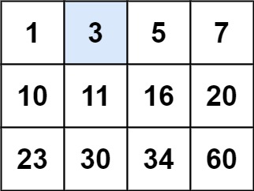

## [74. 搜索二维矩阵](https://leetcode.cn/problems/search-a-2d-matrix/)

给你一个满足下述两条属性的 `m x n` 整数矩阵：

- 每行中的整数从左到右按**非严格递增**顺序排列。
- 每行的**第一个**整数大于前一行的**最后一个**整数。

给你一个整数 `target` ，如果 `target` 在矩阵中，返回 `true` ；否则，返回 `false` 。

**示例 1：**



```
输入：matrix = [[1,3,5,7],[10,11,16,20],[23,30,34,60]], target = 3
输出：true
```

**示例 2：**

```
输入：matrix = [[1,3,5,7],[10,11,16,20],[23,30,34,60]], target = 13
输出：false
```

**提示：**

- `m == matrix.length`
- `n == matrix[i].length`
- `1 <= m, n <= 100`
- `-104 <= matrix[i][j], target <= 104`

## 构造二分

在这道题的要求中，每一列不光是递增的，每一行的第一个数还要比上一行的最后一个数大。但其实没啥用。

为什么要从右上角，因为右上角向左是变小，向下是变大，一定要让顺序相反，这样每次就能排除一条路径。

```java
class Solution {
    public boolean searchMatrix(int[][] matrix, int target) {
        // 检查矩阵是否为空或第一行是否为空。重点。
        if (matrix == null || matrix.length == 0 || matrix[0].length == 0) {
            return false;
        }

        int rows = matrix.length;  // 矩阵的行数
        int cols = matrix[0].length;  // 矩阵的列数
        int row = 0, col = cols - 1;  // 从右上角开始搜索

        // 进行搜索
        while (row < rows && col >= 0) {
            if (matrix[row][col] == target) {
                return true;  // 找到目标值，返回 true
            } else if (matrix[row][col] < target) {
                row++;  // 如果当前值小于目标值，向下移动
            } else {
                col--;  // 如果当前值大于目标值，向左移动
            }
        }

        return false;  // 未找到目标值，返回 false
    }
}
```

- 时间复杂度：$O(m + n)$
- 空间复杂度：$O(1)$
