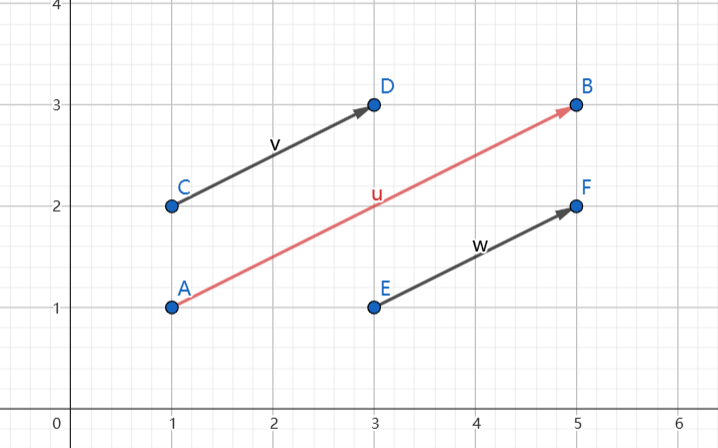

## [33. 搜索旋转排序数组](https://leetcode.cn/problems/search-in-rotated-sorted-array/)

整数数组 `nums` 按升序排列，数组中的值 **互不相同** 。

在传递给函数之前，`nums` 在预先未知的某个下标 `k`（`0 <= k < nums.length`）上进行了 **旋转**，使数组变为 `[nums[k], nums[k+1], ..., nums[n-1], nums[0], nums[1], ..., nums[k-1]]`（下标 **从 0 开始** 计数）。例如， `[0,1,2,4,5,6,7]` 在下标 `3` 处经旋转后可能变为 `[4,5,6,7,0,1,2]` 。

给你 **旋转后** 的数组 `nums` 和一个整数 `target` ，如果 `nums` 中存在这个目标值 `target` ，则返回它的下标，否则返回 `-1` 。

你必须设计一个时间复杂度为 `O(log n)` 的算法解决此问题。

**示例 1：**

```
输入：nums = [4,5,6,7,0,1,2], target = 0
输出：4
```

**示例 2：**

```
输入：nums = [4,5,6,7,0,1,2], target = 3
输出：-1
```

**示例 3：**

```
输入：nums = [1], target = 0
输出：-1
```

**提示：**

- `1 <= nums.length <= 5000`
- `-104 <= nums[i] <= 104`
- `nums` 中的每个值都 **独一无二**
- 题目数据保证 `nums` 在预先未知的某个下标上进行了旋转
- `-104 <= target <= 104`

## 二分

> [喜刷刷](https://leetcode.cn/u/zhywanna/)：
> 
> 搞懂这个题的精髓在于三个定理
> 
> 定理一：只有在顺序区间内才可以通过区间两端的数值判断target是否在其中。
>
> 定理二：判断顺序区间还是乱序区间，只需要对比 left 和 right 是否是顺序对即可，left <= right，顺序区间，否则乱序区间。
>
> 定理三：每次二分都会至少存在一个顺序区间。（感谢[@Gifted VVilburgiX](https://leetcode.cn/u/gifted-vvilburgix)补充）

通过不断的用Mid二分，根据定理二，将整个数组划分成顺序区间和乱序区间，然后利用定理一判断target是否在顺序区间，
如果在顺序区间，下次循环就直接取顺序区间，如果不在，那么下次循环就取乱序区间。

我们需要先确定目标值在哪个区间里，下面的代码看起来没问题，其实有问题。
例如输入nums = [4,5,6,7,8,1,2,3] target = 8 输出的是 -1 而不是 4。
n=8，n-1=7，mid=3，nums[mid]=7<8，8>nums[r]=3，r=mid-1=2，但是2是在左边区间里，永远也找不到8。
问题就出在右侧不是递增序列时我们不能让r=mid-1，而应该让r=r-1，对左侧也类似，
例如输入[5,1,2,3,4]，target=2。但是这样时间复杂度就不是logn了。原因是我们在一个非顺序的区间内判断，这样每次只能排除一个元素。

```java
class Solution {
    public int search(int[] nums, int target) {
        int n = nums.length; // 数组长度
        
        if (n == 0) {
            return -1; // 如果数组为空，返回 -1
        }
        if (n == 1) {
            return nums[0] == target ? 0 : -1; // 如果数组只有一个元素，判断是否与目标值相等，相等返回索引 0，否则返回 -1
        }
        
        int l = 0, r = n - 1; // 左右指针分别指向数组的起始和末尾位置
        while (l <= r) { // 循环直到左指针大于右指针
            int mid = (l + r) / 2; // 计算中间位置的索引
            
            if (nums[mid] == target) { // 如果中间元素等于目标值，返回中间索引
                return mid;
            } else if (nums[mid] > target) { // 
                if (nums[l] <= target) { // 左侧是递增序列
                    r = mid - 1; // 缩小右边界
                } else { // 左侧不是递增序列
                    l = mid + 1; // 应该改成l = l + 1;
                }
            } else { // 
                if (nums[l] <= nums[mid]) { // 左侧是递增序列
                    l = mid + 1; // 缩小左边界
                } else { // 左侧不是递增序列
                    if ()
                    r = mid - 1; // 应该改成r = r - 1;
                }
            }
        }
        
        return -1; // 若未找到目标值，返回 -1
    }
}
```

要想让时间复杂度是对数级，我们需要每次都在顺序区间内做判断，这样每次都能去掉或选择一半的区间。因此我们需要先确定出顺序区间。对于一个只旋转了一次的数组，我们每次二分都能确定一个顺序区间。

**这道题的重点是每一段都是递增的，并且其中一段的最小值大于另一段的最大值，所以根据边界和mid处元素的大小就能直接确定区间的递增性。**



同一组升序数据，旋转排序后只是把值域对应的定义域的顺序颠倒了下。旋转排序前[1,2]对应的定义域是[1,3]，[2,3]对应的定义域是[3,5]，
旋转排序后[1,2]对应的定义域是[3,5]，[2,3]对应的定义域是[1,3]。

**注意旋转排序后这两段值域是不重叠的，所以只需要比较nums[mid]和左端点的大小即可确定nums[mid]是否位于左端点上方的值域中。同一值域中的数是递增的。**

```java
class Solution {
    public int search(int[] nums, int target) {
        int n = nums.length; // 数组长度
        if (n == 0) {
            return -1; // 如果数组为空，返回 -1
        }
        if (n == 1) {
            return nums[0] == target ? 0 : -1; // 如果数组只有一个元素，判断是否与目标值相等，相等返回索引 0，否则返回 -1
        }
        
        int l = 0, r = n - 1; // 左右指针分别指向数组的起始和末尾位置
        while (l <= r) { // 循环直到左指针大于右指针
            int mid = (l + r) / 2; // 计算中间位置的索引，向下取整
            
            if (nums[mid] == target) { // 如果中间元素等于目标值，返回中间索引
                return mid;
            }
            
            // 先找到递增序列，再去递增序列中执行二分
            if (nums[0] <= nums[mid]) { // 如果mid左侧是递增序列。重点。
                if (nums[0] <= target && target < nums[mid]) { // 如果目标值在左侧递增序列中
                    r = mid - 1; // 缩小右边界
                } else {
                    l = mid + 1; // 否则在右侧序列中。注意target不会等于nums[mid]，因为上面已经判断过了。
                }
            } else { // 如果mid左侧不是递增序列，则右侧一定是递增序列
                if (nums[mid] < target && target <= nums[n - 1]) { // 如果目标值在右侧递增序列中
                    l = mid + 1; // 缩小左边界
                } else {
                    r = mid - 1; // 否则在左侧序列中
                }
            }
        }
        
        return -1; // 若未找到目标值，返回 -1
    }
}
```

- 时间复杂度：$O(\log n)$
- 空间复杂度：$O(1)$