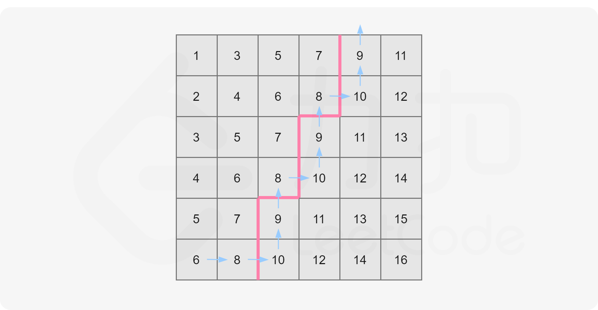

## [378. 有序矩阵中第 K 小的元素](https://leetcode.cn/problems/kth-smallest-element-in-a-sorted-matrix/)

给你一个 `n x n` 矩阵 `matrix` ，其中每行和每列元素均按升序排序，找到矩阵中第 `k` 小的元素。

请注意，它是 **排序后** 的第 `k` 小元素，而不是第 `k` 个 **不同** 的元素。

你必须找到一个内存复杂度优于 `O(n^2)` 的解决方案。

**示例 1：**

```
输入：matrix = [[1,5,9],[10,11,13],[12,13,15]], k = 8
输出：13
解释：矩阵中的元素为 [1,5,9,10,11,12,13,13,15]，第 8 小元素是 13
```

**示例 2：**

```
输入：matrix = [[-5]], k = 1
输出：-5
```

**提示：**

- `n == matrix.length`
- `n == matrix[i].length`
- `1 <= n <= 300`
- `-109 <= matrix[i][j] <= 10^9`
- 题目数据 **保证** `matrix` 中的所有行和列都按 **非递减顺序** 排列
- `1 <= k <= n^2`

**进阶：**

- 你能否用一个恒定的内存(即 `O(1)` 内存复杂度)来解决这个问题?
- 你能在 `O(n)` 的时间复杂度下解决这个问题吗?这个方法对于面试来说可能太超前了，但是你会发现阅读这篇文章（ [this paper](http://www.cse.yorku.ca/~andy/pubs/X+Y.pdf) ）很有趣。

## 归并行数组+小顶堆

> 本方法只利用了一部分性质（每一行是一个有序数列，而忽视了列之间的关系）。

注意到矩阵的每一行均为一个有序数组，因此我们要从这 n 个有序数组中找第 k 大的数，可以想到利用归并排序的做法，归并到第 k 个数即可停止。

归并操作即 [23. 合并K个排序链表](https://leetcode-cn.com/problems/merge-k-sorted-lists/)。

```java
class Solution {
    public int kthSmallest(int[][] matrix, int k) {
        // 创建一个优先队列，用于存储矩阵中的元素，按照元素值的大小进行升序排序
        PriorityQueue<int[]> pq = new PriorityQueue<int[]>(new Comparator<int[]>() {
            public int compare(int[] a, int[] b) {
                return a[0] - b[0]; // 按照元素值的大小进行比较
            }
        });
        
        int n = matrix.length; // 获取矩阵的行数
        // 将每一行的第一个元素加入优先队列中
        for (int i = 0; i < n; i++) {
            // 将元素值、行索引和列索引作为数组存入优先队列中
            pq.offer(new int[]{matrix[i][0], i, 0});
        }
        
        // 重复执行 k - 1 次以下操作，即弹出 k-1 次，此时堆顶元素就是第 k 小的元素
        for (int i = 0; i < k - 1; i++) {
            int[] now = pq.poll(); // 弹出当前优先队列中最小的元素
            if (now[2] != n - 1) { // 如果当前元素不是所在行的最后一个元素
                // 将当前元素所在行的下一列元素加入优先队列中
                // 行索引不能删，因为我们要用行列索引确定元素值，两个索引缺一不可。这就像合并多个有序链表一样，行索引用来指示哪个链表。重点。
                pq.offer(new int[]{matrix[now[1]][now[2] + 1], now[1], now[2] + 1});
            }
        }
        
        // 返回优先队列中的最小元素值，即第 k 小的元素值，即队首元素。
        return pq.poll()[0];
    }
}
```

- 时间复杂度：$O(k\log n)$，归并 k 次，每次堆中插入和弹出的操作时间复杂度均为 $\log n$。
- 空间复杂度：O(n)，堆的大小始终为 n。

注意，$k$ 在最坏情况下是 $n^2$，因此该解法的最坏时间复杂度为 $O(n^2\log{n})$。

## 二分查找边界，构造二叉搜索树

不仅矩阵的行是递增的，列也是递增的，所以可以沿着反对角线查找，类似二叉搜索树。



```java
class Solution {
    public int kthSmallest(int[][] matrix, int k) {
        int n = matrix.length; // 获取矩阵的行数（矩阵是 n x n 的）
        int left = matrix[0][0]; // 初始化左边界为矩阵中的最小值
        int right = matrix[n - 1][n - 1]; // 初始化右边界为矩阵中的最大值

        // 使用二分查找法，在 left 和 right 之间查找第 k 小的元素。左闭右开。注意left和right是元素值，不是索引！
        while (left < right) {
            // 计算中间值（向下取整，因为左边是闭），为什么不用(left+right)/2？因为要防止溢出
            int mid = left + ((right - left) >> 1);
            // 如果矩阵中小于等于 mid 的元素数量不少于 k 个，则收缩右边界
            if (check(matrix, mid, k, n)) {
                right = mid;
            } else {
                left = mid + 1; // 否则，收缩左边界
            }
        }
        return left; // 返回第 k 小的元素
    }

    // 检查矩阵中小于等于 mid 的元素数量是否不少于 k 个
    public boolean check(int[][] matrix, int mid, int k, int n) {
        int i = n - 1; // 从左下角开始。i是行索引，j是列索引。重点。
        int j = 0;
        int num = 0; // 计数小于等于 mid 的元素数量

        // 遍历矩阵
        while (i >= 0 && j < n) {
            if (matrix[i][j] <= mid) { // 如果当前元素小于等于 mid
                num += i + 1; // 累加当前列中小于等于 mid 的元素数量
                j++; // 移动到下一列，保持行不变。
            } else {
                i--; // 否则，移动到上一行
            }
        }
        return num >= k; // 如果小于等于 mid 的元素数量不少于 k 个，则返回 true
    }
}
```

- 时间复杂度：$O(n\log (r-l))$。二分查找的次数为 $O(\log (r-l))$，每次操作的时间复杂度为 O(n)。
- 空间复杂度：$O(1)$。