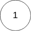

## [141. 环形链表](https://leetcode.cn/problems/linked-list-cycle/)

给你一个链表的头节点 `head` ，判断链表中是否有环。

如果链表中有某个节点，可以通过连续跟踪 `next` 指针再次到达，则链表中存在环。 为了表示给定链表中的环，评测系统内部使用整数 `pos` 来表示链表尾连接到链表中的位置（索引从 0 开始）。**注意：`pos` 不作为参数进行传递** 。仅仅是为了标识链表的实际情况。

*如果链表中存在环* ，则返回 `true` 。 否则，返回 `false` 。

**示例 1：**


```
输入：head = [3,2,0,-4], pos = 1
输出：true
解释：链表中有一个环，其尾部连接到第二个节点。
```

**示例 2：**


```
输入：head = [1,2], pos = 0
输出：true
解释：链表中有一个环，其尾部连接到第一个节点。
```

**示例 3：**



```
输入：head = [1], pos = -1
输出：false
解释：链表中没有环。
```

**提示：**

- 链表中节点的数目范围是 `[0, 10^4]`
- `-105 <= Node.val <= 105`
- `pos` 为 `-1` 或者链表中的一个 **有效索引** 。

**进阶：**你能用 `O(1)`（即，常量）内存解决此问题吗？

## 快慢指针

快慢指针同时同地开始遍历，但步长不同，如果有环，则两个指针一定会相遇。

```java
/**
 * Definition for singly-linked list.
 * class ListNode {
 *     int val;
 *     ListNode next;
 *     ListNode(int x) {
 *         val = x;
 *         next = null;
 *     }
 * }
 */
public class Solution {
    public boolean hasCycle(ListNode head) {
        ListNode slow = head;
        ListNode fast = head;
        
        // 这里应该改成 fast != null && fast.next != null，不然当无环时下面的fast.next.next会报空指针错。
        // while (slow != null && fast != null) {
        // fast 是探路者，循环结束条件最好依赖于它。因为 fast 一次走两步，所以它可能走到末尾也可能越过末尾直接走到 null
        // while 只负责前进，有环的话里面的 if 会提前终止的
        while (fast != null && fast.next != null) {
            slow = slow.next;
            fast = fast.next.next;
            
            if (slow == fast) {
                return true;
            }
        }
        return false;
    }
}
```

- 时间复杂度：O(n)
- 空间复杂度：O(1)