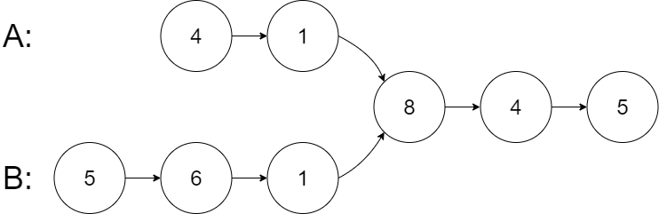
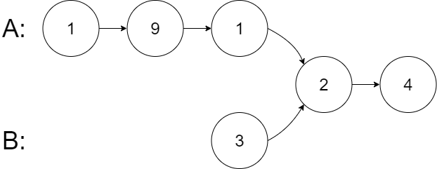
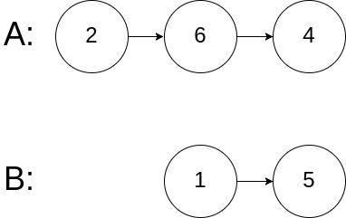

## [160. 相交链表](https://leetcode.cn/problems/intersection-of-two-linked-lists/)

给你两个单链表的头节点 `headA` 和 `headB` ，请你找出并返回两个单链表相交的起始节点。如果两个链表不存在相交节点，返回 `null` 。

图示两个链表在节点 `c1` 开始相交：


题目数据 **保证** 整个链式结构中不存在环。

**注意**，函数返回结果后，链表必须 **保持其原始结构** 。

**自定义评测：**

**评测系统** 的输入如下（你设计的程序 **不适用** 此输入）：

- `intersectVal` - 相交的起始节点的值。如果不存在相交节点，这一值为 `0`
- `listA` - 第一个链表
- `listB` - 第二个链表
- `skipA` - 在 `listA` 中（从头节点开始）跳到交叉节点的节点数
- `skipB` - 在 `listB` 中（从头节点开始）跳到交叉节点的节点数

评测系统将根据这些输入创建链式数据结构，并将两个头节点 `headA` 和 `headB` 传递给你的程序。如果程序能够正确返回相交节点，那么你的解决方案将被 **视作正确答案** 。

**示例 1：**



```
输入：intersectVal = 8, listA = [4,1,8,4,5], listB = [5,6,1,8,4,5], skipA = 2, skipB = 3
输出：Intersected at '8'
解释：相交节点的值为 8 （注意，如果两个链表相交则不能为 0）。
从各自的表头开始算起，链表 A 为 [4,1,8,4,5]，链表 B 为 [5,6,1,8,4,5]。
在 A 中，相交节点前有 2 个节点；在 B 中，相交节点前有 3 个节点。
— 请注意相交节点的值不为 1，因为在链表 A 和链表 B 之中值为 1 的节点 (A 中第二个节点和 B 中第三个节点) 是不同的节点。换句话说，它们在内存中指向两个不同的位置，而链表 A 和链表 B 中值为 8 的节点 (A 中第三个节点，B 中第四个节点) 在内存中指向相同的位置。
```

**示例 2：**



```
输入：intersectVal = 2, listA = [1,9,1,2,4], listB = [3,2,4], skipA = 3, skipB = 1
输出：Intersected at '2'
解释：相交节点的值为 2 （注意，如果两个链表相交则不能为 0）。
从各自的表头开始算起，链表 A 为 [1,9,1,2,4]，链表 B 为 [3,2,4]。
在 A 中，相交节点前有 3 个节点；在 B 中，相交节点前有 1 个节点。
```

**示例 3：**



```
输入：intersectVal = 0, listA = [2,6,4], listB = [1,5], skipA = 3, skipB = 2
输出：null
解释：从各自的表头开始算起，链表 A 为 [2,6,4]，链表 B 为 [1,5]。
由于这两个链表不相交，所以 intersectVal 必须为 0，而 skipA 和 skipB 可以是任意值。
这两个链表不相交，因此返回 null 。
```

**提示：**

- `listA` 中节点数目为 `m`
- `listB` 中节点数目为 `n`
- `1 <= m, n <= 3 * 104`
- `1 <= Node.val <= 105`
- `0 <= skipA <= m`
- `0 <= skipB <= n`
- 如果 `listA` 和 `listB` 没有交点，`intersectVal` 为 `0`
- 如果 `listA` 和 `listB` 有交点，`intersectVal == listA[skipA] == listB[skipB]`

**进阶：**你能否设计一个时间复杂度 `O(m + n)` 、仅用 `O(1)` 内存的解决方案？

## 双指针-链表拼接，利用全局对称性。

**这道题的重点是相交点后面的元素都相等，即遇到c1，后面的c2肯定也是相交点，
这个特点保证了下图中相交部分的长度是一样的，即A和B中不同的路径只有相交点之前的路径。因此我们把两部分接起来就能让不同的路径的长度一样了。**

例如 A：1->2->3->4->5 和 B：2->3->4->5，这两个链表都可以分为两部分：1->2->3->4 + 4->5，2->3->4 + 4->5，其中4->5是公共的。
所以我们得到一个整体不变量——这三个片段的和相等，所以，我们可以让 `p1` 遍历完链表 `A` 之后开始遍历链表 `B`，让 `p2` 遍历完链表 `B` 之后开始遍历链表 `A`
- (1->2->3)->(4->5)->(2->3)->4
- (2->3)->(4->5)->(1->2->3)->4
这样 `p1` 和 `p2` 能够**同时且是第一次**到达相交节点 4。循环结束的条件就是两个指针指向的元素第一次相等。

如果说两个链表没有相交点，是否能够正确的返回 null 呢？ 

当然可以，因为此时两个指针都会走到null，而null==null，所以也可以退出循环。就相当于相交点是null

```java
class Solution {
    public ListNode getIntersectionNode(ListNode headA, ListNode headB) {
        // 定义两个指针, 第一轮让两个到达末尾的节点指向另一个链表的头部, 最后如果相遇则为交点(在第一轮移动中恰好抹除了长度差)
        // 两个指针等于移动了相同的距离, 有交点就返回, 无交点就是各走了两条指针的长度
        if (headA == null || headB == null) return null;
        
        ListNode pA = headA, pB = headB;
        // 在这里第一轮体现在pA和pB第一次到达尾部会移向另一链表的表头, 而第二轮体现在如果pA或pB相交就返回交点, 不相交最后就是null==null
        // 如果没有相交点，那就是pA==pB==null，也可以退出循环
        while (pA != pB) {
            pA = pA == null ? headB : pA.next;
            pB = pB == null ? headA : pB.next;
        }
        return pA;
    }
}
```

- 时间复杂度：O(n+m)
- 空间复杂度：O(1)

## 提前计算出长度，公平竞赛

「寻找两条链表的交点」的核心在于让 `p1` 和 `p2` 两个指针能够同时到达相交节点 `c1`，可以通过预先计算两条链表的长度来做到这一点。

```java
public ListNode getIntersectionNode(ListNode headA, ListNode headB) {
    int lenA = 0, lenB = 0;
    
    // 计算两条链表的长度
    for (ListNode p1 = headA; p1 != null; p1 = p1.next) {
        lenA++;
    }
    for (ListNode p2 = headB; p2 != null; p2 = p2.next) {
        lenB++;
    }
    
    // 让 p1 和 p2 到达尾部的距离相同
    ListNode p1 = headA, p2 = headB;
    if (lenA > lenB) {
        // 先走lenA-lenB步，一共走lenA步到达结尾后面的null，还剩lenB步到达null
        for (int i = 0; i < lenA - lenB; i++) {
            p1 = p1.next;
        }
    } else {
        for (int i = 0; i < lenB - lenA; i++) {
            p2 = p2.next;
        }
    }
    
    // 看两个指针是否会相同，p1 == p2 时有两种情况：
    // 1、要么是两条链表不相交，他俩同时走到尾部空指针
    // 2、要么是两条链表相交，他俩走到两条链表的相交点
    // 循环结束的条件是两个指针指向的元素第一次相等。
    while (p1 != p2) {
        p1 = p1.next;
        p2 = p2.next;
    }
    return p1;
}
```

