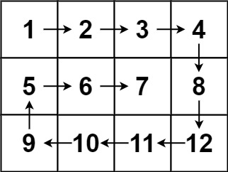

# [54. 螺旋矩阵](https://leetcode.cn/problems/spiral-matrix/)

给你一个 `m` 行 `n` 列的矩阵 `matrix` ，请按照 **顺时针螺旋顺序** ，返回矩阵中的所有元素。

**示例 1：**


```
输入：matrix = [[1,2,3],[4,5,6],[7,8,9]]
输出：[1,2,3,6,9,8,7,4,5]
```

**示例 2：**



```
输入：matrix = [[1,2,3,4],[5,6,7,8],[9,10,11,12]]
输出：[1,2,3,4,8,12,11,10,9,5,6,7]
```

**提示：**

- `m == matrix.length`
- `n == matrix[i].length`
- `1 <= m, n <= 10`
- `-100 <= matrix[i][j] <= 100`

## 按层模拟，剥洋葱

**遍历到最里面只剩一行，可能会从左到右遍历，也可能会从右到左遍历，这取决于它的上一次是从上到下还是从下到上，
所以四个for循环的顺序一定不能错，即从上到下后一定要从右到左，要连续遍历！**

```java
class Solution {
    public List<Integer> spiralOrder(int[][] matrix) {
        // 如果矩阵为空，则直接返回一个空的列表
        if (matrix.length == 0)
            return new ArrayList<Integer>();

        // 定义四个指针，分别表示要遍历的当前层的左边界、右边界、上边界、下边界
        int l = 0, r = matrix[0].length - 1, t = 0, b = matrix.length - 1;
        // x 用于记录 res 数组的当前填充位置
        int x = 0;
        // 预先分配足够空间的数组，用于存放螺旋遍历的结果
        Integer[] res = new Integer[(r + 1) * (b + 1)];

        // 当遍历的层还有元素时，继续遍历
        while (true) {
            // 从左到右遍历上边界
            for (int i = l; i <= r; i++) res[x++] = matrix[t][i];
            // 向下移动上边界，如果上边界超过下边界，结束遍历
            if (++t > b) break;

            // 从上到下遍历右边界
            for (int i = t; i <= b; i++) res[x++] = matrix[i][r];
            // 向左移动右边界，如果右边界超过左边界，结束遍历
            if (l > --r) break;

            // 从右到左遍历下边界
            for (int i = r; i >= l; i--) res[x++] = matrix[b][i];
            // 向上移动下边界，如果下边界超过上边界，结束遍历
            if (t > --b) break;

            // 从下到上遍历左边界
            for (int i = b; i >= t; i--) res[x++] = matrix[i][l];
            // 向右移动左边界，如果左边界超过右边界，结束遍历
            if (++l > r) break;
        }
        // 将结果数组转换为列表并返回。要记住数组转列表的方法。
        return Arrays.asList(res);
    }
}
```

- 时间复杂度：O(mn)，其中 m 和 n 分别是输入矩阵的行数和列数。矩阵中的每个元素都要被访问一次。
- 空间复杂度：O(1)。除了输出数组以外，空间复杂度是常数。